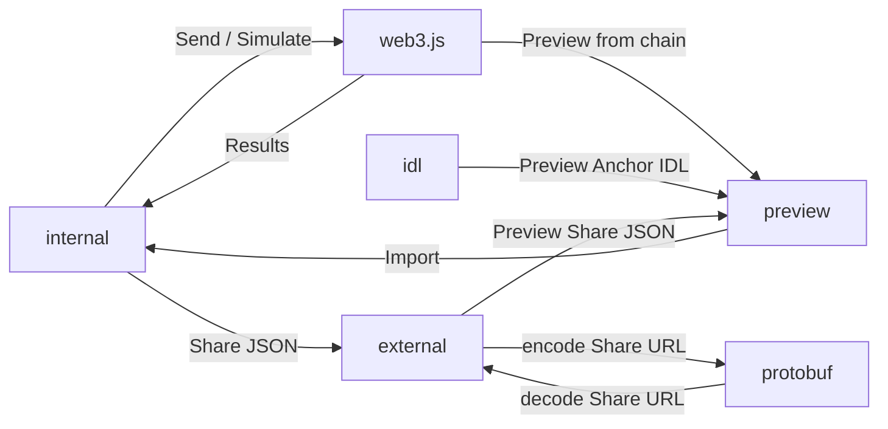

Data Model Mappers
===

`<source>-to-<destination>.ts`

```mermaid
graph LR
    internal -- Send / Simulate --> web3.js
    internal -- Share JSON --> external
    external -- encode Share URL --> protobuf
    protobuf -- decode Share URL --> external
    web3.js -- Preview from chain --> preview
    web3.js -- Results --> internal
    idl -- Preview Anchor IDL --> preview
    external -- Preview Share JSON --> preview
    preview -- Import --> internal
```